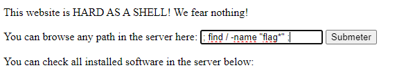
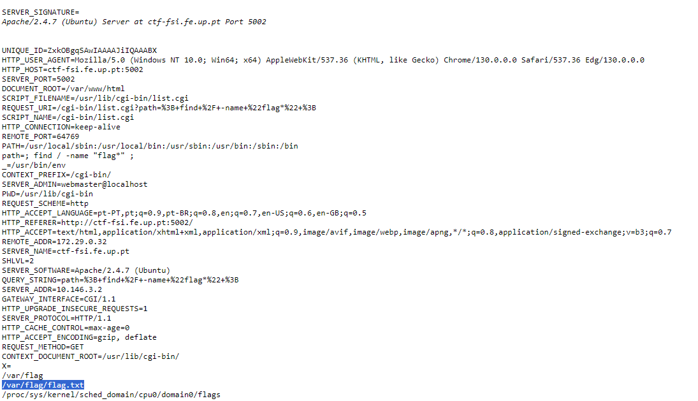
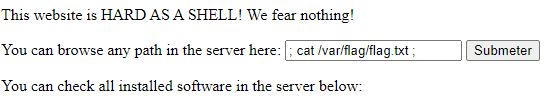
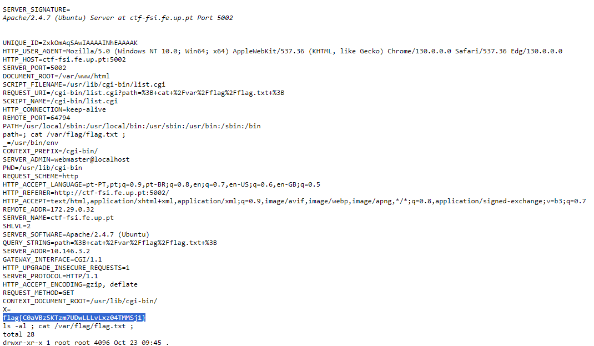

# CTF Semana #4 (Environmental Variables)

## CVE-2014-6271

**1. Como construíste o ataque?** 
Para começar este CTF fizemos, tal como no passado, uma análise da fonte da página (Page Source) através do comando CTRL+U. Assim, verificámos que o site tem por base uma CGI e assenta num sitema Bash de Linux. Desta forma fizemos uma pesquisa na internet sobre problemas com este tipo de sistemas. Descobrimos que podiamos interagir com o site através de comandos passando variáveis e assim, aceder a informações internas da página [1]. Concluímos então que a CVE se tratava da CVE-2014-6271.

Após isto, o processo tornou-se mais ou menos trivial - seguimos um guião de como proceder a este tipo de exploit [2] e passámos os seguintes comandos para o formulário do site (também demonstrados nas figuras 1 e 2 mais abaixo):  
    a) -> "; find / -name "flag*" ;" 
    b) -> "; cat /var/flag/flag.txt ;" 

Como o nosso objetivo final era decobrir a flag pensámos que seria uma boa ideia procurar todas referências internas a esta string ("flag"), sejam elas pastas ou ficheiros. Para isto recorremos ao comando "find" e especificámos "flag*". O '*' é meramente para cumrpir o requisito de procurar todas as referências a esta palavra.

O passo seguinte, após descobrir que havia um ficheiro "flag.txt", foi aceder ao seu conteúdo. Para isso usámos o comando 'cat' seguido do diretório do ficheiro.

Finalmente decobrimos a flag e concluímos a CTF.

**2. De que vulnerabilidade abusaste?** 
A CVE-2014-6271 é uma vulnerabilidade de segurança identificada na Bash. Esta permite a execução de comandos arbitrários em sistemas Linux, que usam Bash em scripts CGI. Neste caso, os scripts que usam este tipo de Shell são o logo.cgi e o list.cgi, que não estão devidamente protegidos, e por isso permitem que o CVE supracitado seja explorado.[1]

**3. Que contramedidas poderiam ter evitado que tivesses tido sucesso?** 
Atualizar a Bash e controlar variáveis de ambiente são bons métodos para a defesa destes ataques. O primeiro, e mais lógico, trata-se de um procedimento fulcral para a mitigação de 'bugs' em qualquer sistema - manter as patches em dia evita erros de versões passadas.  
Para controlar as variáveis de ambiente, seria eficaz verificar o conteúdo da mesma antes de ser passada para a Bash, por exemplo usando um script que invalida qualquer comando não esperado pelo sistema.

[1]https://nvd.nist.gov/vuln/detail/cve-2014-6271 
[2]https://ine.com/blog/shockin-shells-shellshock-cve-2014-6271  

