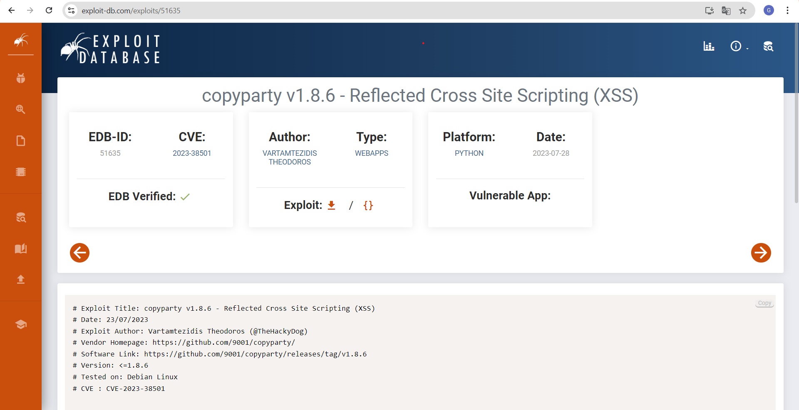
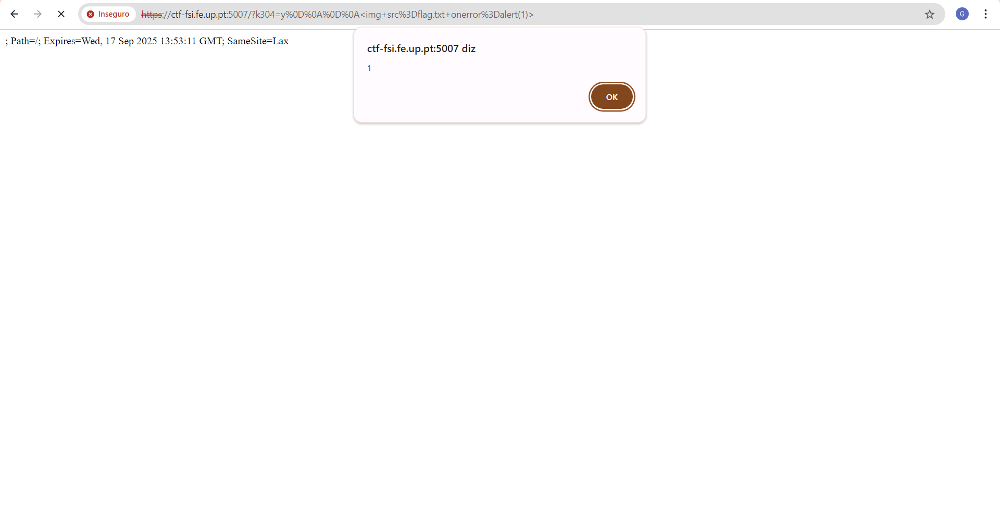
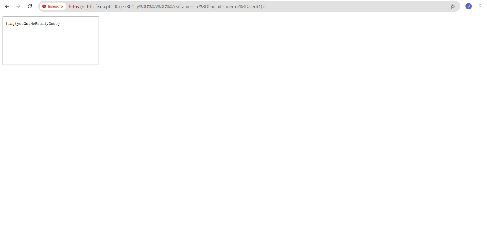

# CTF Semana #7 (XSS)

## Questões iniciais
1. **Encontra o ficheiro referente à flag no servidor. Porque é que não consegues aceder diretamente à flag secreta?**

O ficheiro mencionado é flag.txt, conforme descrito. Ele existe no servidor e, presumivelmente, contém a flag que queremos extrair.

O ficheiro tem o seguinte conteúdo: "Nice try, I am only accessible via JavaScript shenanigans."
Isto sugere que o ficheiro está presente no servidor, mas protegido por lógica JavaScript ou outras restrições.

2. **Este serviço é popular, até pode ser que tenha vulnerabilidades conhecidas. Será que podem ajudar a que acedas à flag?**

Sim, o serviço Copyparty é uma aplicação conhecida, e versões anteriores (como a 1.8.6) possuem vulnerabilidades documentadas:

Vulnerabilidade conhecida (CVE-2023-38501):

A vulnerabilidade de Reflected Cross-Site Scripting (XSS) permite que um atacante injete código malicioso através de parâmetros na URL.
Isso ocorre porque o servidor não valida ou sanitiza adequadamente os valores enviados, permitindo que o HTML ou JavaScript injetado seja refletido de volta no navegador da vítima.

3. **Qual é o tipo da vulnerabilidade de XSS (Reflected, Stored ou DOM) que te permitiu aceder à flag?**

Para termos acesso à flag, usamos uma vulnerabilidade de Reflected XSS.

Por que Reflected XSS?

A aplicação reflete o valor do parâmetro k304 diretamente no HTML gerado, permitindo que HTML ou JavaScript malicioso seja executado pelo navegador.

## Exploit

O ficheiro flag.txt contém uma mensagem que diz:

"Nice try, I am only accessible via JavaScript shenanigans."

Isso indica que:

 - A flag está protegida por lógica JavaScript no lado cliente.
 - Será necessário explorar a vulnerabilidade para que o navegador processe a lógica JavaScript e revele a flag.

<br>
O Copyparty v1.8.6 possui uma vulnerabilidade de Reflected Cross-Site Scripting (XSS).

Essa falha permite a injeção de código JavaScript malicioso através de parâmetros na URL.
Como a vulnerabilidade é reflected, o ataque depende de enviar um link malicioso para a vítima ou testá-lo diretamente.



<br>
<br>

```
# Exploit Title: copyparty v1.8.6 - Reflected Cross Site Scripting (XSS)
# Date: 23/07/2023
# Exploit Author: Vartamtezidis Theodoros (@TheHackyDog)
# Vendor Homepage: https://github.com/9001/copyparty/
# Software Link: https://github.com/9001/copyparty/releases/tag/v1.8.6
# Version: <=1.8.6
# Tested on: Debian Linux
# CVE : CVE-2023-38501


#Description
Copyparty is a portable file server. Versions prior to 1.8.6 are subject to a reflected cross-site scripting (XSS) Attack. 

Vulnerability that exists in the web interface of the application could allow an attacker to execute malicious javascript code by tricking users into accessing a malicious link.

#POC
https://localhost:3923/?k304=y%0D%0A%0D%0A%3Cimg+src%3Dcopyparty+onerror%3Dalert(1)%3E
```

O exploit inicial fornecido na _POC_ utiliza um payload que injeta uma tag _img_ com um evento _onerror_ contendo código JavaScript. Para utilizarmos este payload corretamente, alteramos certas partes do mesmo para ser direcionado para o nosso objetivo.

#### Especificação do ficheiro

As mudanças fundamentais foram a especificação do ficheiro em questão - _flag.txt_.

```
https://ctf-fsi.fe.up.pt:5007/?k304=y%0D%0A%0D%0A%3Cimg+src%3Dflag.txt+onerror%3Dalert(1)%3E
```



O evento onerror é disparado quando a imagem falha em carregar, executando o código JavaScript alert(1).

O alerta 1 confirma que o JavaScript foi injetado e executado.

#### Alteração de img para iframe

O próximo passo foi modificar o payload substituindo _img_ por _iframe_:

Um _iframe_ é mais adequado para carregar páginas inteiras ou recursos JavaScript, ao invés de imagens.


Payload final:
```
https://ctf-fsi.fe.up.pt:5007/?k304=y%0D%0A%0D%0A%3Ciframe+src%3Dflag.txt+onerror%3Dalert(1)%3E
```


<br>
Concluímos que a execução foi bem-sucedida quando observamos o conteúdo da flag:


