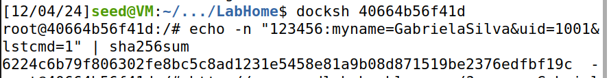
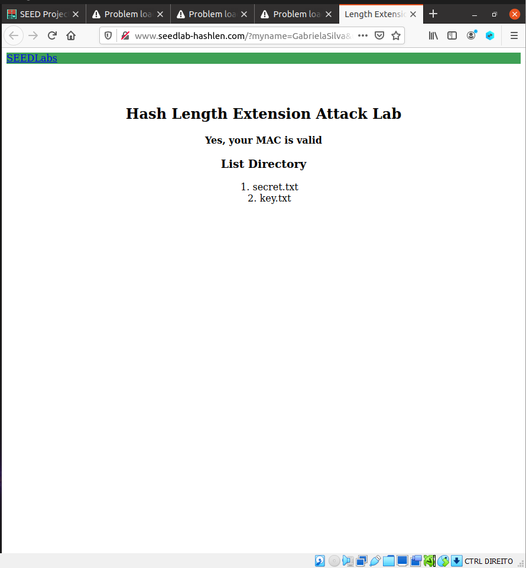
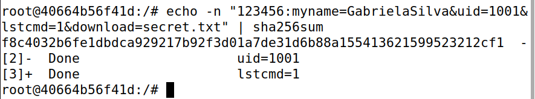
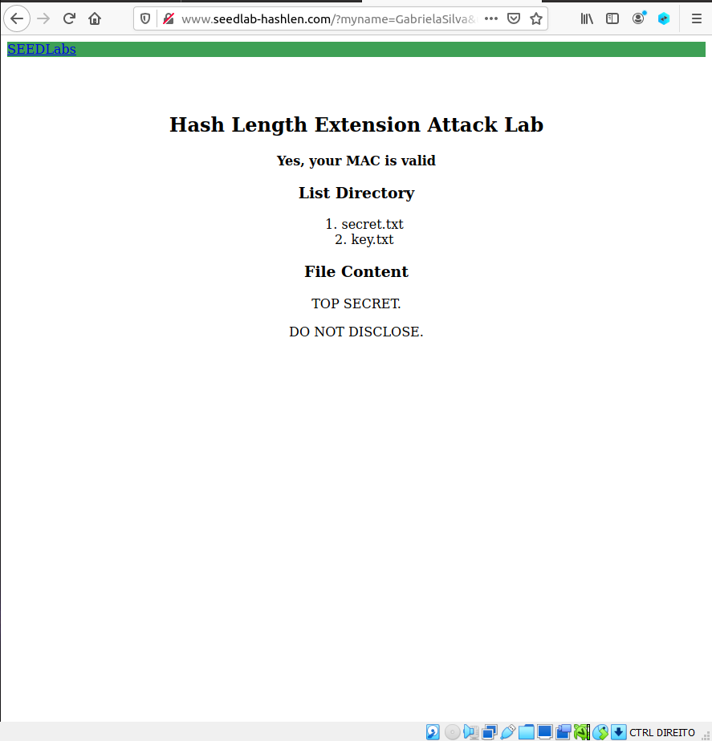
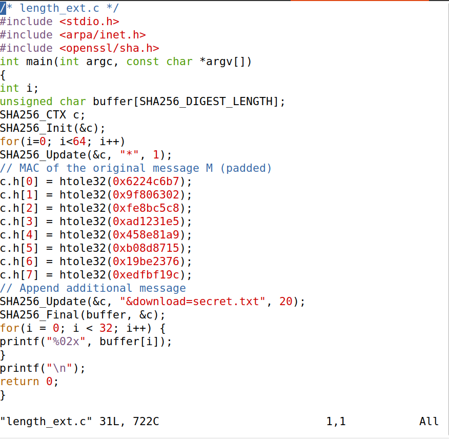
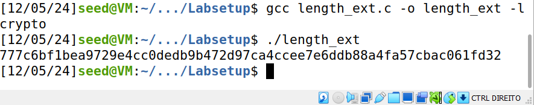
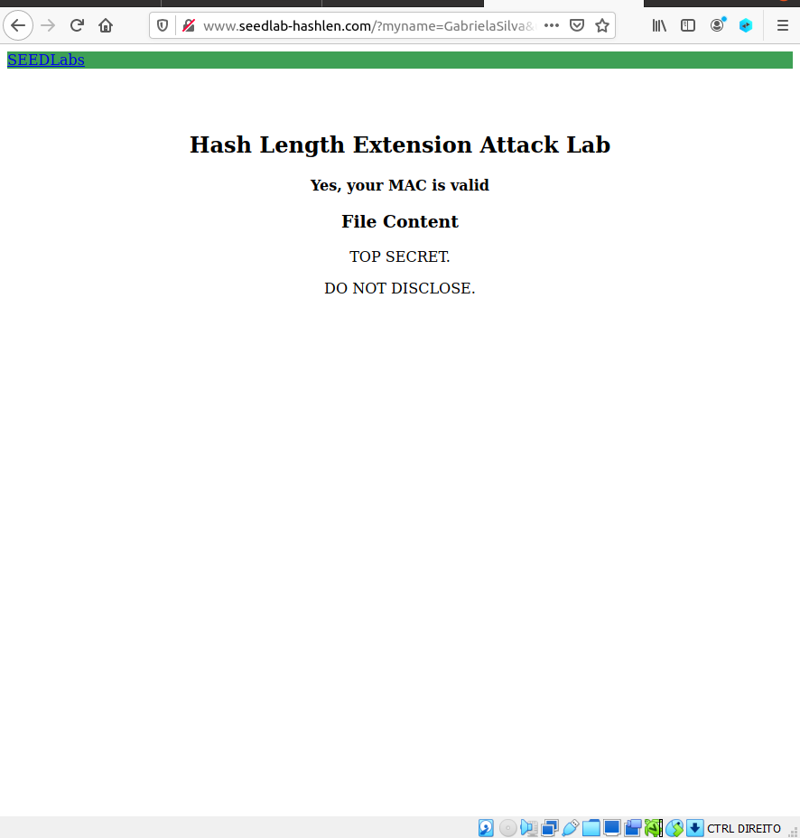

# Hash Length Extension Attack Lab

Para a realização deste lab, passamos por todos os passos de introdução e preparação de ambiente que nos foram fornecidos no guião https://seedsecuritylabs.org/Labs_20.04/Files/Crypto_Hash_Length_Ext/Crypto_Hash_Length_Ext.pdf. 

Após nos certificarmos que tudo estava como era pedido, e com os containers a correr no background, começamos o _Hash Length Extension Attack Lab_.

### Task 1

Na primeira tarefa, é-nos pedido que corramos 2 comandos:

```
lstcmd;
download;
```

Para isto, precisamos de obter o **MAC** respetivo para cada comando.

Como foi explicado no guião, podemos encontrar o MAC concatenando a chave com o conteúdo do request:

```
Key:R = 123456:myname=JohnDoe&uid=1001&lstcmd=1
```

A _key_ e _uid_ foram obtidos através do ficheiro keys.txt - escolhemos 123456=1001; substituímos o nome pelo nome de um dos elementos do nosso grupo. E assim obtivemos:

```
123456:myname=GabrielaSilva&uid=1001&lstcmd=1
```

Corremos, então, o comando que nos faz obter o **MAC** adequado para o request do comando list. Podemos observar, na seguinte imagem, o resultado do mesmo.

<br>

De seguida, com o **mac** obtido no passo anterior, finalizamos a contrução do url:

```
http://www.seedlab-hashlen.com/?myname=GabrielaSilva&uid=1001&lstcmd=1&mac=6224c6b79f806302fe8bc5c8ad1231e5458e81a9b08d871519be2376edfbf19c
```

Como está claro na imagem, conseguimos obter uma listagem dos ficheiros, o que indica que o comando foi executado e o URL foi construído corretamente.


<br>


Como teste, fizemos exatamente os mesmos passos, mas com a inclusão de _&download=secret.txt_.


Obter o mac para a instrução em questão:

<br>


Construir o url:

```
http://www.seedlab-hashlen.com/?myname=GabrielaSilva&uid=1001&lstcmd=1&download=secret.txt&mac=f8c4032b6fe1dbdca929217b92f3d01a7de31d6b88a155413621599523212cf1
```


E obtivemos a listagem mais o conteúdo de _secret.txt_.

<br>


### Task 2

Para a tarefa 2, é-nos pedido que façamos um padding da seguinte mensagem:

```
123456:myname=GabrielaSilva&uid=1001&lstcmd=1
```

Seguindo os passos que nos fornecem para a obtenção deste padding:

```
 > tamanho da mensagem = 45

 > 64 - 45 = 19

 > 45*8 = 360

 > 360 em hexadecimal -> 0x168

Logo, tirando 0x80, 0x01, 0x68, restam-nos (19 - 3) 16 0's

Padding final:

 > %80%00%00%00%00%00%00%00%00%00%00%00%00%00%00%00%00%01%68
```


### Task 3

Agora que temos o padding, precisamos de obter o **MAC** correto para que consigamos visualizar o conteúdo de _secret.txt_. Para isso, recorremos ao código que nos foi fornecido. Neste ficheiro, alteramos o **MAC** que já lá estava definido para o **MAC** da mensagem original. Também alteramos o campo de _"append additional message"_ para _"&download=secret.txt"_:

<br>


Após compilar e correr o código, obtivemos o novo **MAC**:

<br>


O próximo passo é criar o url novo:

```
http://www.seedlab-hashlen.com/?myname=GabrielaSilva&uid=1001&lstcmd=1%80%00%00%00%00%00%00%00%00%00%00%00%00%00%00%00%00%01%68&download=secret.txt&mac=777c6bf1bea9729e4cc0dedb9b472d97ca4ccee7e6ddb88a4fa57cbac061fd32
```

Cujo resultado foi o pretendido:

<br>
