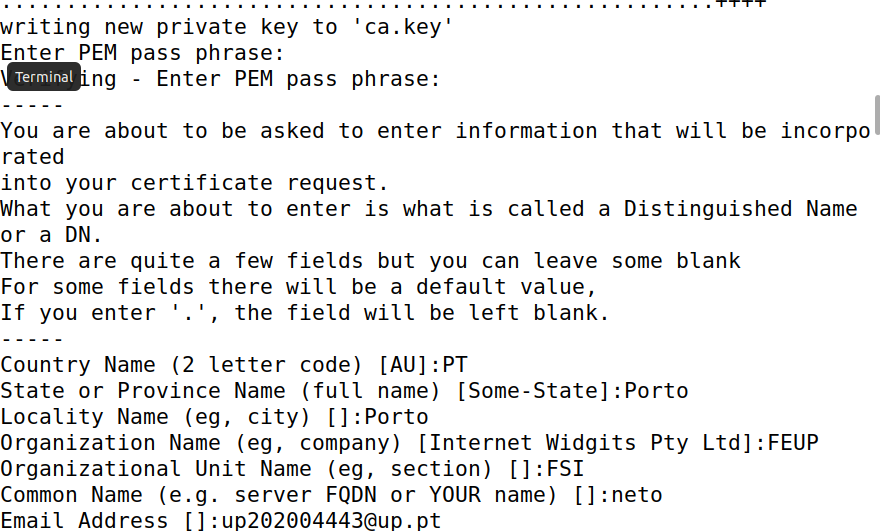

# Public-Key Infrastructure (PKI) Lab

Após completarmos os passos de setup do ambiente de trabalho, demos início à execução das tasks.

### Task 1 - Becoming a Certificate Authority (CA)

Copiamos openssl.cnf para o nosso diretório para alterarmos os pontos que nos são pedidos. Criamos os ficheiros necessários que estão indicados no ficheiro openssl.

<br>


Após isto, vamos criar um self-signed Certificate CA:

<br>

Respondendo às perguntas do logbook:

• **What part of the certificate indicates this is a CA’s certificate?**

    R.: Basic Contraints: flag CA set as TRUE
   
<br>

   


• **What part of the certificate indicates this is a self-signed certificate?**

    R.:  Issuer and subject of certificate são iguais

   <br>


• **In the RSA algorithm, we have a public exponent e, a private exponent d, a modulus n, and two secret
numbers p and q, such that n = pq. Please identify the values for these elements in your certificate
and key files.**

    R.:  n is modulus, p and q are prime1 and prime2

   <br>
   <br>
   <br>


### Task 2 - Generating a Certificate Request for Your Web Server

<br>


### Task 3 - Generating a Certificate for your server

Nesta tarefa, alterarmos o CSR criado na tarefa 2 para um self-signed Certificate. Para isso:

• Editamos o _openssl_ para permitir que "openssl ca" copie o campo da extensão do pedido para o certificado final.

<br>

<br>


### Task 4 - Deploying Certificate in an Apache-Based HTTPS Website

Aqui, vamos implantar o certificado que criamos em um site HTTPS baseado no Apache, hospedado no conteiner Docker:

1. **Configurar o ficheiro .conf**
<br>Ajustamos o ficheiro para corresponder aos dados do servidor, alterando os caminhos para o certificado e a chave privada que foram gerados.

<br>


2. **Transferir o Certificado e a Chave para o conteiner**
<br>Para garantir que o certificado e a chave estejam disponíveis no conteiner, temos as opções abaixo:

 - Renomear Arquivos: Alterar os nomes e caminhos dos ficheiros da chave e do certificado para corresponderem aos mencionados no Dockerfile do servidor.
 - Modificar o Dockerfile: Editar o Dockerfile para atualizar os caminhos do certificado e da chave.
 - Usar Volumes: Montar uma pasta de volumes para passar os arquivos da chave e do certificado para dentro do conteiner e, depois, movê-los para o local indicado.

<br>

<br>


3. **Ativar o Módulo SSL e o Site no Apache**
<br>Ativar o módulo SSL e configurar o site no Apache.
4. **Iniciar o Servidor Apache**
5. **Executar o servidor Apache**

6. **Aceder ao site no Navegador**
<br>Abrir o navegador e aceder ao endereço para verificar se o site HTTPS está a funcionar.

<br>

Depois, verificamos o Certificado:

<br>

### Task 5 - Launching a Man-In-The-Middle Attack

Nesta task, criamos um novo VirtualHost para a página falsa:

```
sudo nano /etc/apache2/sites-available/fake_example_ssl.conf
```

onde injetamos o seguinte conteúdo:

```
<VirtualHost *:443>
    ServerName www.example.com
    DocumentRoot /var/www/fake_example

    SSLEngine on
    SSLCertificateFile /certs/server.crt
    SSLCertificateKeyFile /certs/server.key
</VirtualHost>

```

Ativamos o novo site e reinicamos o Apache.

De seguida, adicionamos a seguinte linha ao ficheiro /etc/hosts

<br>

Depois, tentamos aceder ao site no Firefo e verificamos um certificado inválido. Ou seja, o PKI protege contra ataques MITM ao validar a autoridade do certificado.


### Task 6 - Launching a Man-In-The-Middle Attack with a Compromised CA

Aqui, geramos um certificado assinado pela CA que está comprometida.

```
openssl req -new -key /certs/server.key -out compromised.csr
openssl x509 -req -in compromised.csr -CA /certs/ca.crt -CAkey /certs/ca.key -CAcreateserial -out compromised.crt -days 365
```

Atualizamos a configuração do site falso e reiniciamos o Apache.

Depois disto, voltamos a instalar o certificado CA no firefox e testamos o Ataque.

Observamos que não apareceu nenhum aviso de segurança, o que demonstra como um atacante pode se fazer passar por qualquer site se a CA for comprometida. 

