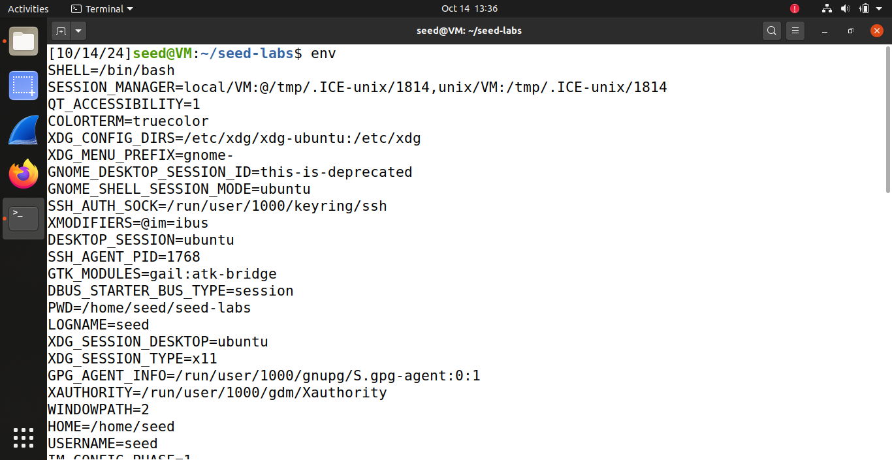
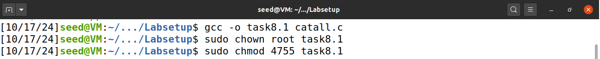
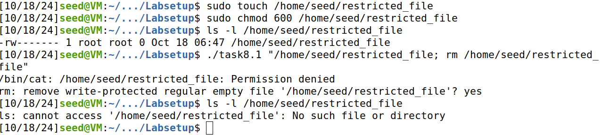

# Semana #4 (Environment Variable and Set-UID Lab)

## Questão 1

## Task 1:



## Task 2:

Após a execução dos passos 1, 2 e 3, concluímos que os dois ficheiros criados - os dois resultados das execuções do ficheiro myprintenv.c, com as linhas de código printenv() comentadas alternadamente - não diferenciam em nada. Obtivemos este resultado através do comando diff, como está claro na imagem abaixo.


Sendo que a função printenv() faz um print das variáveis de ambiente do processo em questão, e que o processo filho herda essas variáveis do seu processo pai, então o resultado da execução deste print será o mesmo para qualquer dos processos após um fork(). Daí não se ter obtido nenhuma diferença entre os dois ficheiros criados com as duas execuções diferentes - file1 e file2.

## Task 3:

Nesta tarefa trabalhamos com a função execve. Executamos o ficheiro myenv.c que inicia outro processo através de execve. Este processo devia mostrar as suas variáveis de ambiente. No entanto, não houve qualquer saída.

Isto pode ser explicado pela forma como execve funciona. Uma vez que inicia outro processo e lhe passa o array de variáveis de ambiente através do seu terceiro argumento - que estava como NULL - então o novo processo foi iniciado sem variáveis de ambiente. Daí a ausência de qualquer saída.

Após modificarmos o código, como estava orientado para o passo seguinte, o comportamento foi outro. Como deixamos de passar o array de variáveis de ambiente para um ponteiro NULL e começamos a passar para o ponteiro environ - que aponta para as variáveis de ambiente do processo pai - a saída apresentou algo diferente. Passamos a ver as variáveis de ambiente do processo pai. Isto confirma que o processo filho herdou as variáveis de ambiente passadas através do terceiro argumento da função execve.


## Task 4:

Criámos um arquivo chamado mysystem.c com o código fornecido. Esse programa chama o mesmo processo que o anterior (Task 3), mas desta vez, utiliza a função system em vez de execve. Após compilar e executar o programa, o resultado exibido foram as variáveis de ambiente do processo pai, como era esperado. Isso acontece porque a função system utiliza internamente execl, que por sua vez chama execve com as variáveis de ambiente do processo pai, e no final executa o /bin/sh com o argumento passado para a função system.


## Task 5:

### Step 1

Criamos o ficheiro task5.c com o código fornecido. Corremos esse ficheiro e obtivemos as variáveis de ambiente.


### Step 2 and 3
De seguida, tornamos o user root como o seu dono e transformamos a Set-UID


Alteramos as variáveis de ambiente pedidas no enunciado:

```
$ export PATH=”changing”
$ export LD_LIBRARY_PATH=”EV’s”
$ export TASK5=”ok?”
```


E verificamos as mudanças dessas variáveis de ambiente após a execução de a.out. O que também verificamos foi que a variável “LD_LIBRARY_PATH” não estava presente no output.


## Task 6:

Basicamente, o objetivo é alterar as permissões de um ficheiro específico ao qual chamamos de “secret_file” e que está localizado em /Documents. Para isso, seguimos os seguintes passos:

O código fornecido foi utilizado para criarmos o ficheiro task6.c na pasta do seed_labs. Quando o executamos este foi o output:


Aqui verificamos que o ficheiro apenas executa o comando “ls”, como está claro no código.

De seguida, passamos para o diretório /home/seed/ onde criamos o ficheiro ls.c com o seguinte código:

```c
#include <stdio.h>
#include <stdlib.h>
int main()
{
    printf("Your file is safe with me!\n");
    system("ls");
    return 0;
}
```

Após executá-lo obtivemos o seguinte resultado:


Mais uma vez, a execução é o comando “ls” com o print da mensagem que adicionamos.

Para já estamos apenas a executar os ficheiros separadamente, e sem alterar quaisquer permissões ainda.

O que fazemos a seguir é executar o comando “export PATH=/home/seed:$PATH” para modificar a variável de ambiente PATH, que é usada pelo sistema para localizar executáveis.

Depois vamos alterar as permissões e propriedades do ficheiro task6:

```
$ sudo chown root task6
$ sudo chmod 4755 task6
```

O uso do número 4755 provém de:<br>
4-
Ativa o “Setuid” que permite que o ficheiro seja executado com os privilégios do proprietário, que neste caso será root devido ao comando anterior. Então, qualquer utilizador que executar o ficheiro task6 vai fazê-lo com permissões de root.<br>
7->
O root tem permissão de leitura, escrita e execução.<br>
5->
Indica que os membros do grupo têm permissões de leitura e execução mas não de escrita.<br>
5->
Os outros utilizadores têm também permissões de leitura e execução mas não de escrita.

Assim, este comando faz com que o ficheiro task6 possa ser executado com privilégios de root, independentemente de quem os executa, mas apenas pode ser modificado pelo root.

Após a execução destes últimos três comandos, executamos task6 para verificar o que acontecia de diferente. Percebemos que passou a executar o ficheiro de /home/seed, ls.


Alteramos o código de ls.c para:
```c
#include <stdio.h>
#include <stdlib.h>

int main()
{
    printf("Your file is safe with me!\n");
    system("chmod 777 /home/seed/Documents/secret_file");
    return 0;
}
```
Verificamos as permissões deste ficheiro “secret_file” antes e depois de executarmos novamente ls.c.
A diferença foi que, após modificarmos o código malicioso, o ficheiro passou a ter permissões de leitura, escrita e execução (-rwxrwxrwx) quando, anteriormente, tinha apenas as seguintes permissões: -rw-rw-r– .


## Questão 2

## Task 8.1:

1. Compilamos o código de catall.c, o que gerou um executável chamado task8.1.
2. De seguida, alteramos o task8.1 para ser propriedade do root e receber as permissões Set-UID, o que permite que qualquer usuário que o execute tenha os privilégios de root. 



3. Criamos um arquivo chamado restricted_file com permissões que impediam que o usuário seed, neste caso o Bob, o lesse. Apenas o proprietário do arquivo (root) tem permissões de leitura e escrita.
4. Confirmamos as permissões do arquivo restricted_file.
5. Por último, executamos novamente o programa task8.1 com um comando que tentava ler o restricted_file e que depois o removia.
6. Confirmamos que o arquivo foi removido.



Se eu fosse o Bob, ao compilar catall.c e com a execução do programa task8.1, eu poderia comprometer a integridade do sistema. Apesar de o Bob não ter permissões para ler ou modificar o arquivo restricted_file devido às permissões definidas, o programa ao ser executado como root permite que os comandos que normalmente seriam restritos ao usuário comum sejam realizados.
Mais especificamente, ao fornecer o comando "/home/seed/restricted_file; rm -f /home/seed/restricted_file" ao programa, o comando rm é executado no contexto de root, o que permite que o Bob remova um arquivo que ele não teria permissões para excluir em circunstâncias normais. Isto demonstra que o uso da função system() em programas Set-UID apresenta uma grande vulnerabilidade. Nesta implementação que era aparentemente segura, a escolha de system() para invocar comandos do shell introduziu um vetor de ataque que pode ser facilmente explorado.