# Semana #5 (Buffer-Overflow Attack Lab - Set-UID Version)

## Questão 1

## Task 1:
- Desativar 'Address Space Randomization': O comando sudo sysctl -w kernel.randomize_va_space=0 desativa a randomização dos endereços de memória, o que facilita ataques de buffer overflow.</br>
- Configurar /bin/sh: O comando sudo ln -sf /bin/zsh /bin/sh substitui a shell padrão, que é /bin/sh pelo zsh, o que permite execução em processos Set-UID, facilitando ataques que envolvem o aumento de privilégios.</br>
- Aceder ao diretório onde se encontra o arquivo shellcode.c e usar o comando make para compilar os binários. O ficheiro Makefile está configurado para criar dois binários com as seguintes opções:</br>
a32.out: Compilado para arquitetura de 32 bits. gcc -m32 -z execstack -o a32.out call_shellcode.c </br>
a64.out: Compilado para arquitetura de 64 bits. gcc -z execstack -o a64.out call_shellcode.c </br>
- Após executar ./a32.out e ./a64.out aparece um prompt de shell ($). Isto ocorre porque o shellcode que foi compilado utiliza a chamada de sistema execve() para iniciar a shell (/bin/sh ou /bin//sh, dependendo da arquitetura). Esta chamada substitui o processo atual pela shell especificado, o que resulta numa nova shell interativa. </br>
- No prompt de shell ($) podemos executar comandos como whoami, ls e outros do shell porque uma vez que o shell foi iniciado, estamos a interagir com um novo processo de shell que herda as permissões do processo pai (o seu programa original). Isto significa que podemos executar qualquer comando que o usuário atual tenha permissão.</br>

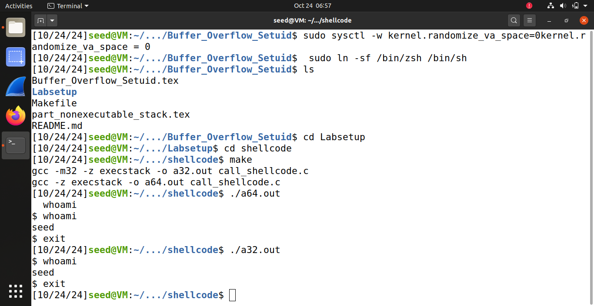

## Task 2:
- Abrir Makefile e editar o valor de L1 para 100+8*4=132. </br>
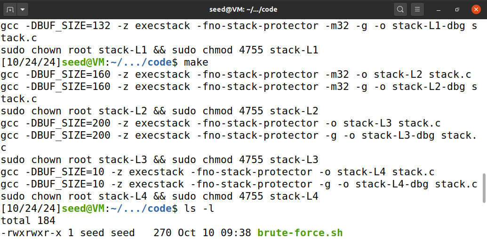 </br>

- Tornar o programa num programa Set-UID de propriedade do root.
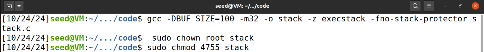

- Compilar o programa usando make, que gera os executáveis (stack-L1, stack-L2 ...)

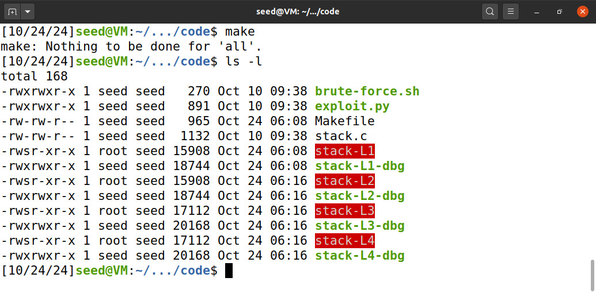

## Task 3:
Após a realização das tarefas 1 e 2, temos tudo pronto para iniciar o ataque.
- Começamos criar o ficheiro badfile.
- De seguida, corremos a versão debug do programa stack-L1-dbg para retirar as localizações das variáveis da stack. Obtivemos os seguinte resultados:

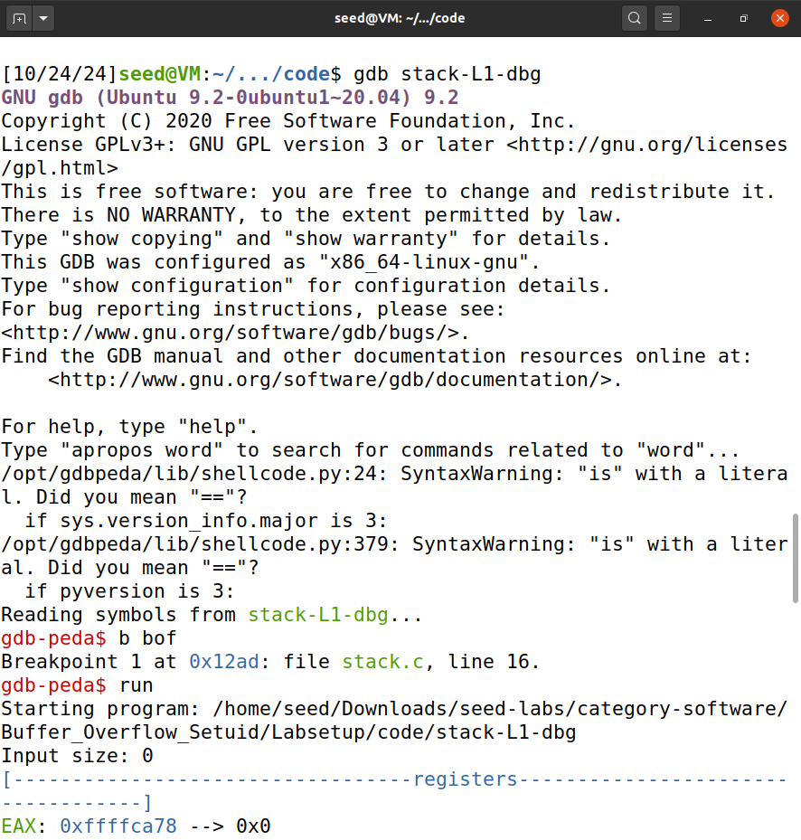


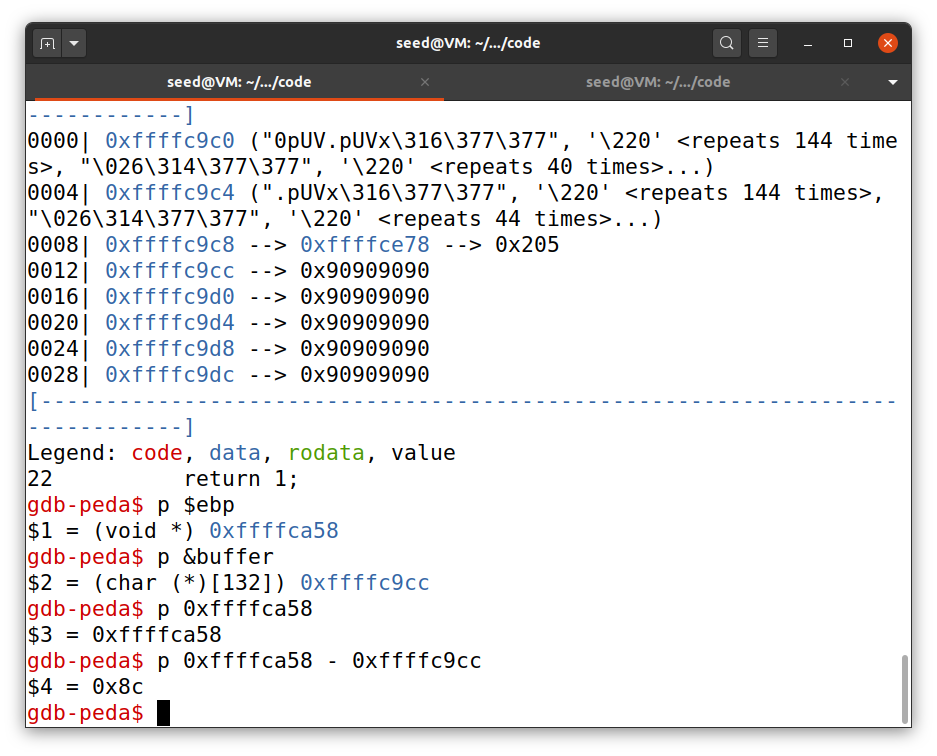


- O passo seguinte consiste em alterar as variáveis necessárias do script de exploit.py. Estas variáveis foram:

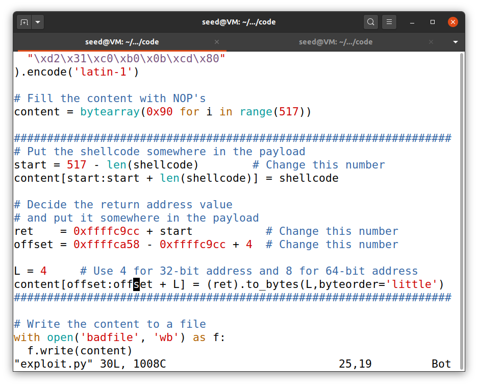

##### start = 517 - len(shellcode) :
O valor de start define onde o shellcode será inserido dentro do conteúdo do payload. </br>
O valor 517 corresponde ao tamanho total do payload, e len(shellcode) é o comprimento do código de shell. Ao subtrair o tamanho da shellcode, colocamo-la no final do buffer. Isto permite que o endereço de retorno seja redirecionado para uma área próxima do shellcode, sem precisar de ser muito preciso.

##### ret = 0xffffc9cc + start :
A variável ret contém o endereço de retorno que será reescrito no stackframe. </br>
O valor 0xffffc9cc é o endereço base da stack, onde o buffer está alocado. Adicionando start, obtemos o endereço final onde o shellcode estará na memória.

##### offset = 0xffffca58 - 0xffffc9cc + 4 :
0xffffca58 é o endereço da pilha onde o ponteiro de retorno está armazenado após a função bof ser chamada.</br>
A diferença entre esses dois valores (0xffffca58 - 0xffffc9cc) é o deslocamento do ponteiro de retorno em relação ao buffer. </br>
Adicionamos 4 bytes ao valor para saltar a parte do frame do bof e aceder diretamente o local do ponteiro de retorno.


Assim, após correr os ficheiros exploit.py e stack-L1, conseguimos acesso à shell.

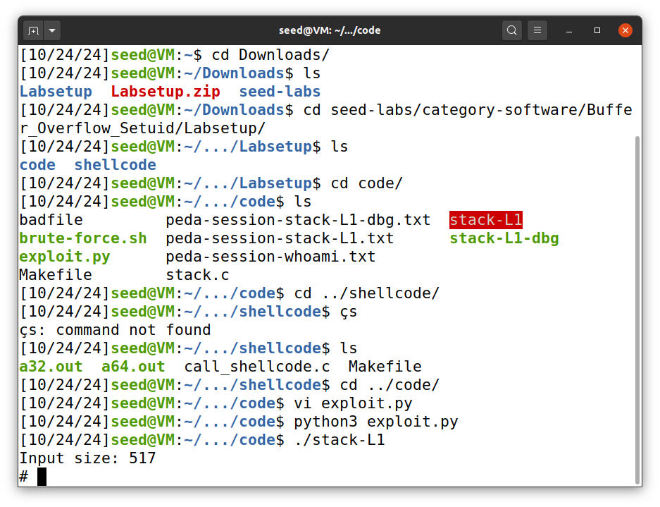


Este ataque foi possível devido à vulnerabilidade do código:

```c
    strcpy(buffer, str);
```

Como str pode ser maior que o buffer (buffer[BUF_SIZE]), é possível reescrever partes da stack, incluindo o return address, para redirecionar a execução para o nosso shellcode.

## Questão 2

Vamos passar à descrição da realização do ataque pedido na questão 2. O objetivo é explorar a vulnerabilidade para reescrever o endereço de retorno da função, permitindo a execução de outro código. Para isto, usamos o ficheiro badfile para injetar um payload que preenche o buffer e reescreve o endereço de retorno.

### Passo 1

Começamos por preencher o badfile com 517 “A’s”, o que simula o overflow do buffer. Logo, o endereço de retorno é reescrito com um ‘A’ que tem o valor hexadecimal de “0x41414141”.
Podemos ver o conteúdo do ficheiro na figura 1.

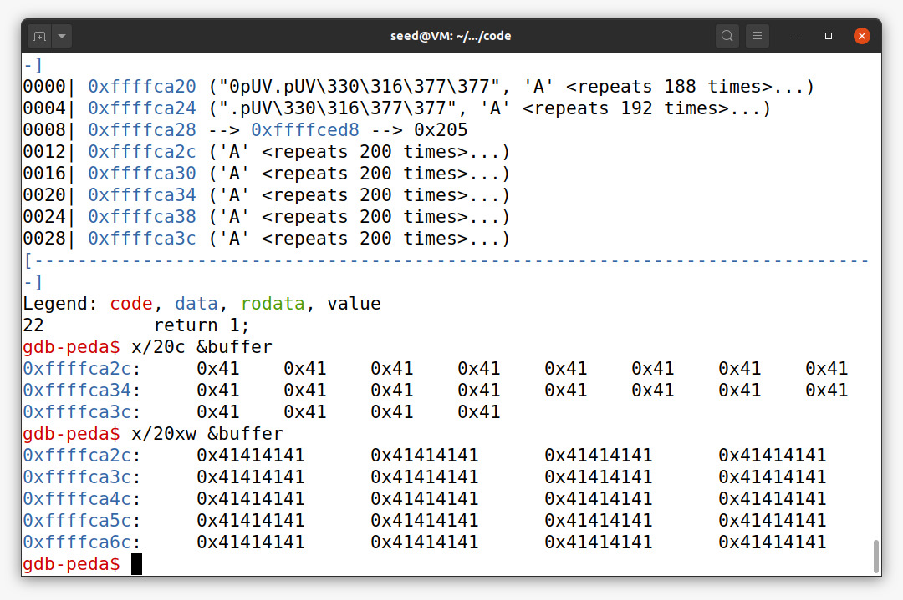

Na figura 2 podemos observar o resultado de correr programa no GDB até ao ponto em que retorna da chamada à função bof.

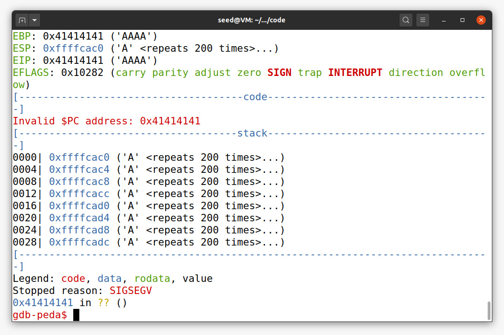

### Passo 3

De seguida, executamos o programa no GDB e definimos dois breakpoints nas funções principais:

```c
b main
b bof
run
```

Avançamos até à função vulnerável, ‘strcpy’, onde o buffer é reescrito.

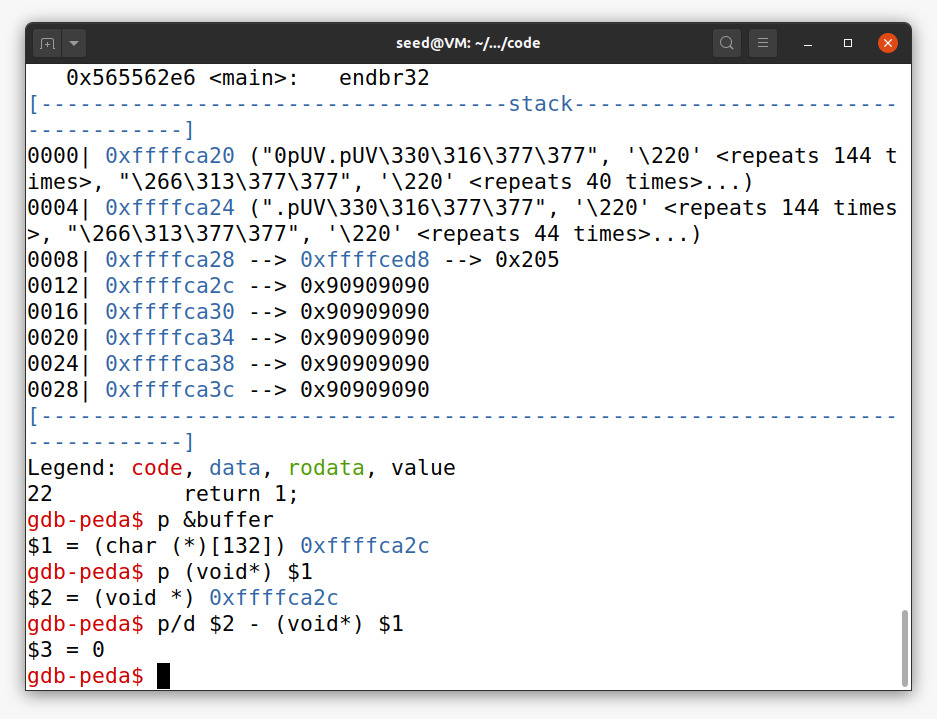

### Passo 3

Neste passo retiramos o endereço do buffer

```c
$gdb p &buffer
```

O resultado está apresentado na seguinte figura.

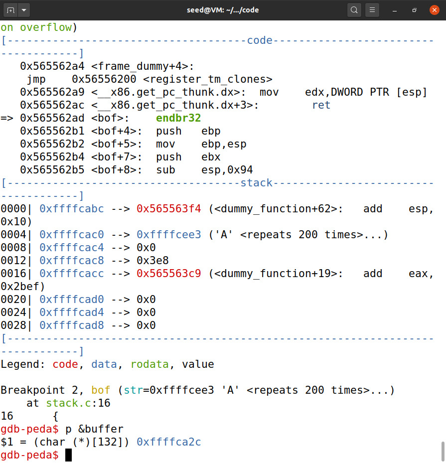

Com base neste endereço, teremos que modificar os valores das variáveis do ficheiro exploit.py – ret e offset.

### Passo 4

Analisamos o conteúdo da memória após o overflow. Através do comando ***x/20c &buffer***, confirmamos que os 20 primeiros bytes do buffer contêm o valor ***0x41***. Isto confirma-nos que a cópia foi bem-sucedida.

Na imagem podemos observar o constatado em cima:

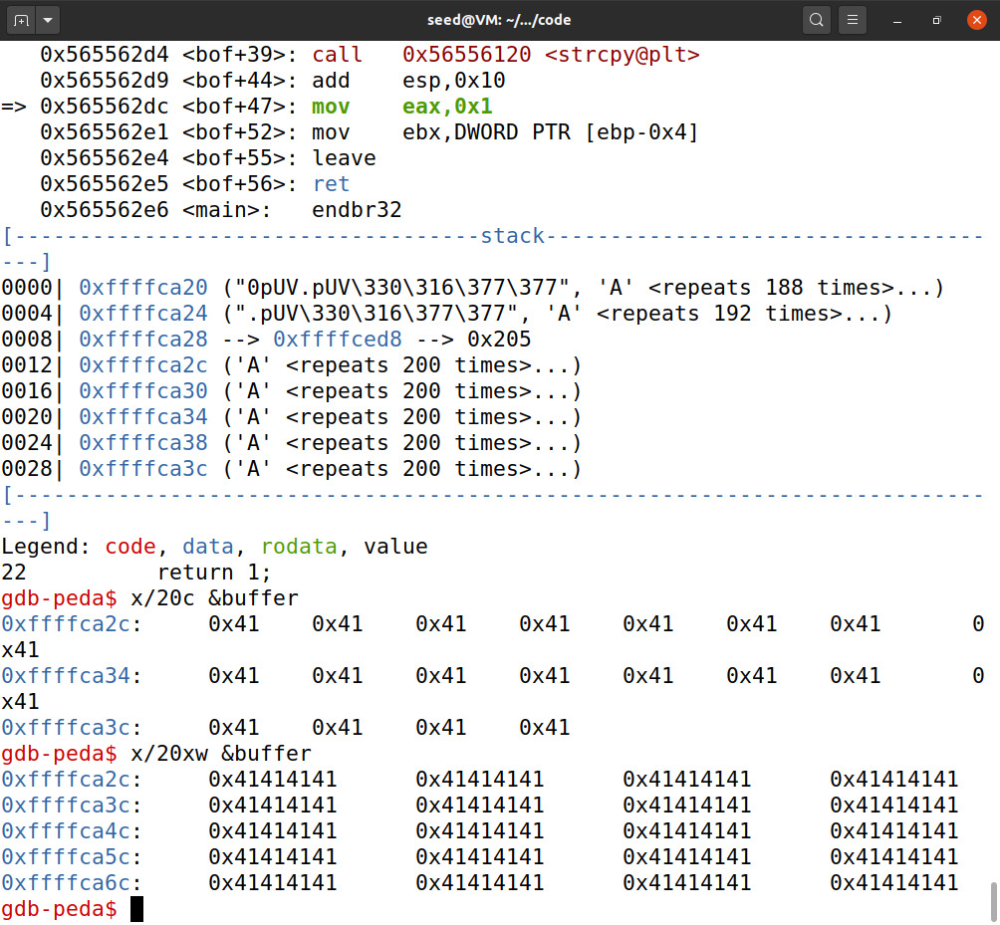
