# Guião Semana 6 (Format-String Vulnerability Lab)

## Questão 1

O objetivo deste logbook é perceber em detalhe os ataques por manipulação de format strings. Para isso, começamos por preparar o nosso ambiente de trabalho, como orientado no guião fornecido.

Uma vez preparado, podemos começar a explorar esta vulnerabilidade de Format-String.

##### Task 1: Crashing the Program

O objetivo desta tarefa é provocar uma falha no programa explorando uma vulnerabilidade no comando printf do código.

Para isto, escrevemos um simples _hello_ no servidor:


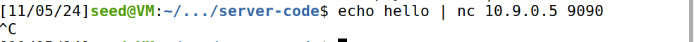

###
Ao usar o ```nc``` (netcat), ligamos a entrada e a saída padrão a um socket que se conecta ao servidor na porta 9090. A opção ```-N``` faz com que o _socket_ seja encerrado assim que o fim de arquivo (EOF) é alcançado na entrada, evitando que a conexão permaneça ativa por tempo indeterminado. Isso garante que a string enviada seja encaminhada corretamente para o comando printf no servidor.

Podemos ver o resultado no terminal do server:


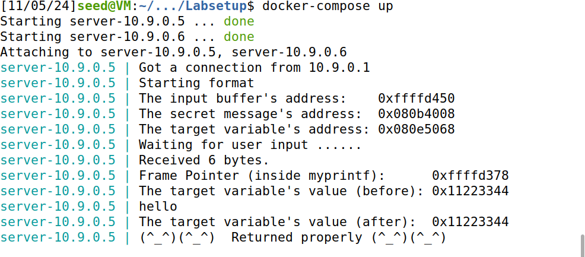


Obtivemos “Returned properly” e conseguimos ver “hello” como um output, no terminal. Isto indica que a string foi enviada ao servidor com sucesso.

De seguida, para testar o crash, escrevemos o seguinte payload para o server:

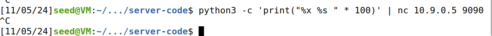

###
Podemos observar o crash na seguinte imagem:

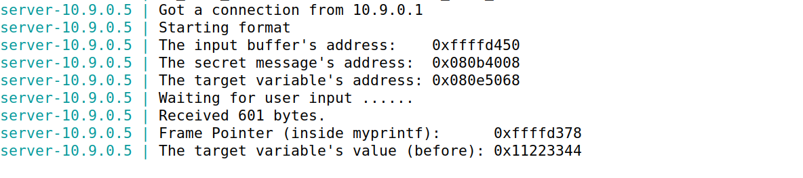

Fizemos o mesmo com o badfile, após correr o ```build_script.py```


###

Obtivemos um crash, como está obvio na seguinte imagem.

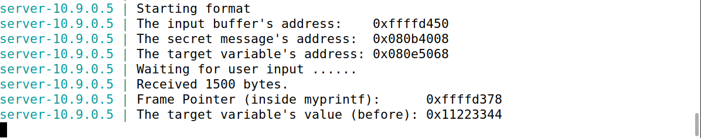


##### Task 2: Printing Out the Server Program’s Memory

Na Task 2, o objetivo foi explorar a vulnerabilidade de formatação para extrair dados da memória do servidor.


###### Task 2.A: Extraindo Dados da Pilha

A meta foi imprimir os primeiros bytes do buffer de entrada que enviei enviou para o servidor, identificando exatamente quantos ```%x``` são necessários para alcançar o início do buffer na pilha.

Então, modificamos o build_script.py para gerar um payload específico:

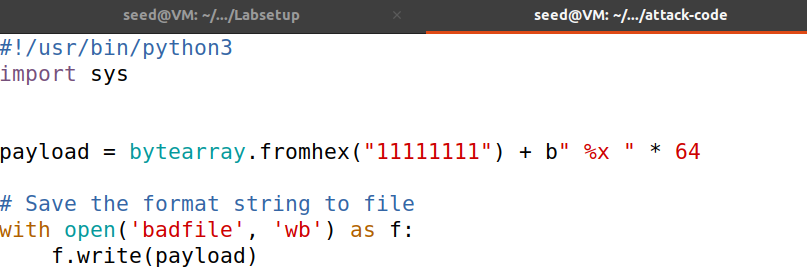

###

Adicionamos uma sequência de ```%x``` repetida, com uma quantidade inicial estimada para cobrir uma faixa maior da pilha e facilitar a localização do valor ```11111111```.

O resultado foi o seguinte:

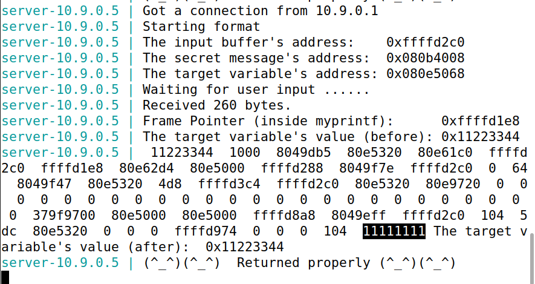

###

Através deste output no terminal, observamos onde ```11111111``` aparece e determinamos que foram necessários 64 ```%x``` para alcançar o início do buffer de entrada.

###### Task 2.B: Extraindo Dados do Heap

Queremos extrair o conteúdo da mensagem secreta que está armazenada numa região de heap do servidor.

No passo anterior, retirámos também o endereço da mensagem secreta:


###

Neste caso, o endereço era 0x080b4008.


A partir daqui, temos que construir o payload.
Para imprimir o conteúdo da mensagem, usamos o endereço da mesma no início do buffer e configurámo-lo para ser lido como uma string (```%s```).

O novo script de build_script.py:


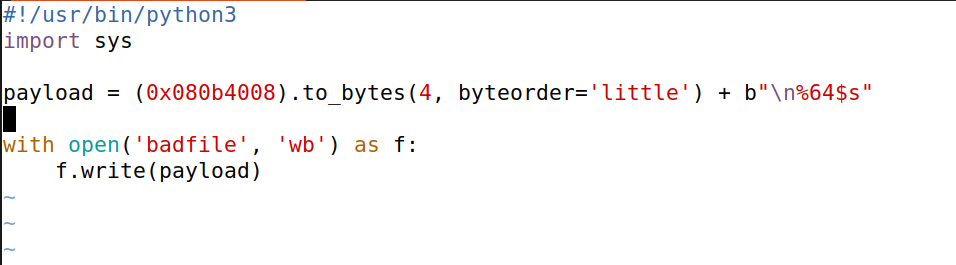

###

O que resultou na impressão do conteúdo da mensagem secreta:


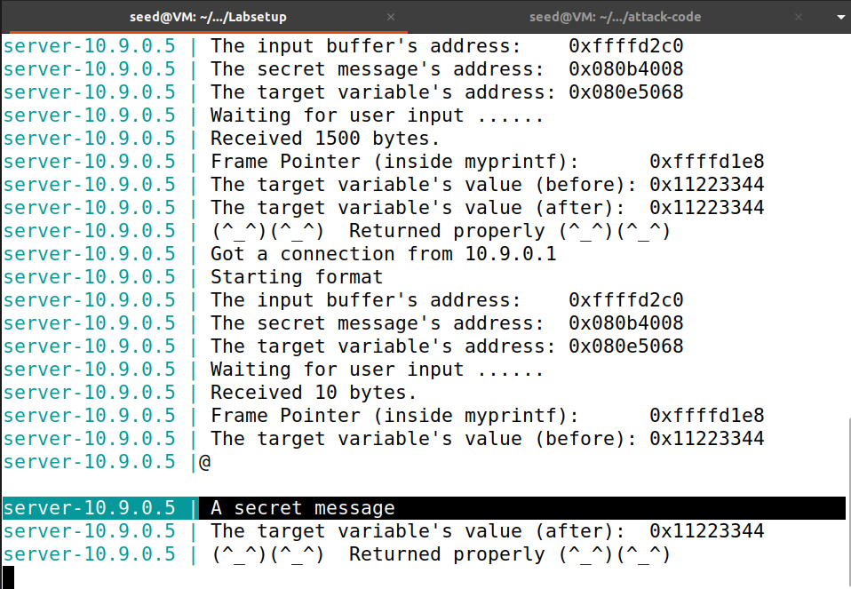


##### Task 3: Modifying the Server Program’s Memory

A ideia desta tarefa é aproveitar o formato ```%n```, que permite gravar na memória, para alterar o valor da variável target.


###### A. Change the value to a different value

O primeiro passo que fizemos foi retirar o valor do endereço do target.


###

Neste caso, o endereço do targer é 0x080e5068.

Assim, podemos passar pelos mesmos passos da task 2, usando ``` %64$n ``` em vez do usado ```%64$s```. A utilização do especificador ```%n``` permite escrever na memória no endereço especificado.

Então, modificamos o script outra vez para:

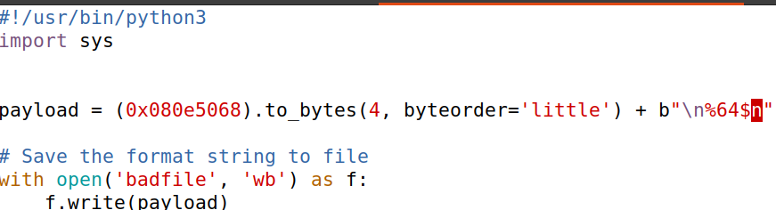

<br>  


Após correr 

```c
cat badfile | nc 10.9.0.5 9090
```

o resultado foi:

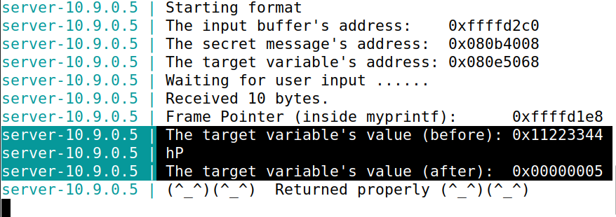


Podemos ver que o endereço do target foi mudado, com sucesso, para ```0x00000005```

###### B. Change the value to 0x5000

Convertemos o valor hexadecimal de 0x5000 para decimal: 20480. Então, queremos escrever este valor no targer. Para isso, e tendo em conta como o especificador ```%n``` funciona, temos que escrever o mesmo número (20480) de caracteres antes.

A esse valor temos que retirar o número de caracteres do endereço do target inicial, que está no início do buffer. Chegamos à conclusão que temos que substrair 4 caracteres, 1 por cada byte do endereço.

```20480 - 4 = 20476```

Utilizamos a estratégia de **padding**.
O script ficou como está na imagem:

#

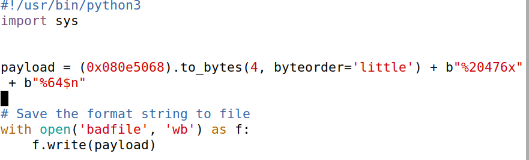

#
E podemos observar a alteração bem sucedida do endereço na seguinte imagem:


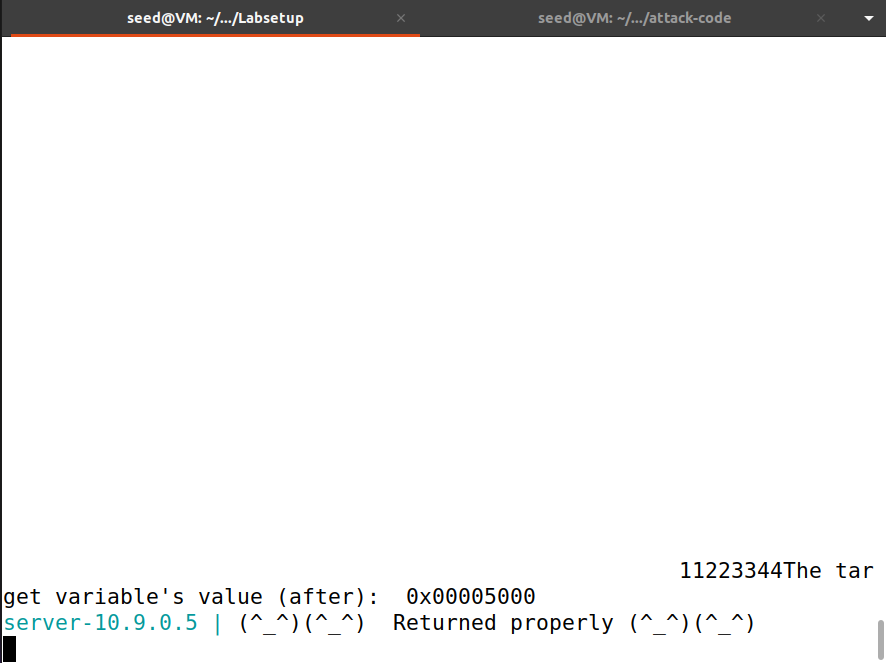

## Questão 2

### CWE-134
A vulnerabilidade ocorre quando a entrada do utilizador é utilizada como argumento de uma função de formatação (como printf) sem sanitização ou validação. Se o utilizador puder introduzir uma string arbitrária contendo especificadores de formato (%x, %s, %n, etc.), ele poderá: </br>
- Ler dados sensíveis da memória.
- Alterar o estado do programa (por exemplo escrevendo na memória com %n).

### Tem que ser sempre o caso em que a format string é alocada na stack para existir uma vulnerabilidade?
Não é essencial que a format string esteja alocada na stack para que exista a vulnerabilidade. O necessário é que a string usada pela função de formatação seja controlada pelo utilizador sem validação. No entanto, quando a format string está na stack, explorar a vulnerabilidade pode ser mais simples.</br>


1. Format String na Stack
Se a string fornecida pelo utilizador for colocada diretamente na stack, a vulnerabilidade pode ser explorada porque o programa usa a string para aceder à memória arbitrária baseada nos especificadores (%x para ler, %n para escrever).</br>
Exemplo:
```
char buffer[256];
gets(buffer); // Entrada do utilizador
printf(buffer); // Sem validação
```
Neste caso, o utilizador controla a string formatada (buffer), que está na stack.</br>


2. Format String na Heap
Mesmo que a string formatada esteja na heap, a vulnerabilidade persiste. Mas, neste caso, o conteúdo da string formatada é interpretado sem restrições.

Exemplo:
```
char *heap_buffer = malloc(256);
gets(heap_buffer); // Entrada do utilizador
printf(heap_buffer); // Sem validação
```
Aqui, a string formatada está na heap, mas o ataque ainda funciona.</br>

3. Format String noutras regiões da memória
A vulnerabilidade ocorre mesmo que a format string esteja noutras regiões, como o segmento de dados ou de texto. O que importa é que a string é controlada pelo utilizador. Por exemplo:

Se o utilizador conseguir modificar uma variável global usada como format string:
```
char *global_string = "Default";
gets(global_string); // Modificável pelo utilizador
printf(global_string); // Vulnerável
```

Ou um endereço referenciado na heap ou stack:
```
char *pointer = malloc(256);
gets(pointer); // Modificável pelo utilizador
printf(pointer); // Vulnerável
```

### Das tarefas realizadas, quais ataques não funcionariam se a format string estivesse a ser alocada na heap e porquê?

Apenas o ataque da Task 2.A (Stack Data) não funcionaria se a format string estivesse a ser alocada na heap pois depende da entrada estar na stack para iterar com %x. Se a entrada estiver na heap, %x não alcançará os dados desejados.
Explicação:

##### Task 1: Crashing the Program

- Descrição: O objetivo é fazer o programa chamar uma instrução inválida, causando um crash, ao passar uma entrada contendo especificadores de formato.

- Funcionamento: O crash ocorre quando a função tenta ler ou processar dados de um endereço inválido, que pode ser causado por %x ou %s aplicados a valores fora do alcance da memória.

- Impacto de estar na heap: Este ataque funcionaria independentemente da localização da format string. Desde que a string formatada controlada pelo utilizador seja usada diretamente, o programa acessará endereços inválidos com base na pilha de chamadas.


##### Task 2.A: Stack Data
- Descrição: O objetivo é imprimir os dados da pilha usando %x repetido até atingir os primeiros 4 bytes do buffer de entrada.

- Funcionamento: Como a entrada do utilizador é armazenada na stack, %x itera sobre os valores da pilha até alcançar os bytes iniciais da entrada.

- Impacto de estar na heap: Este ataque não funcionaria diretamente, pois a entrada estaria na heap, e os especificadores %x apenas iteram sobre a stack (não sobre a heap). Para explorar dados da heap, seria necessário modificar o ataque para aceder a endereços específicos na heap.

##### Task 2.B: Heap Data
- Descrição: O objetivo é imprimir uma string armazenada na heap, sabendo o seu endereço.

- Funcionamento: O ataque requer colocar o endereço da string na format string e usar %s para imprimir o conteúdo armazenado nesse endereço.

- Impacto de estar na heap: Este ataque funcionaria normalmente, já que %s pode aceder a qualquer endereço válido, independentemente de onde a format string esteja. O requisito principal é controlar o conteúdo da string para incluir o endereço correto.

##### Task 3.A: Modificar para qualquer valor
- Descrição: O objetivo é modificar o valor de uma variável no endereço conhecido da memória.

- Funcionamento: O ataque coloca o endereço da variável na format string e usa %n para escrever no endereço.

- Impacto de estar na heap: Este ataque funcionaria mesmo com a format string na heap, pois %n modifica o endereço fornecido, independentemente da localização da format string.

##### Task 3.B: Modificar para 0x5000
- Descrição: Semelhante à Task 3.A mas com a necessidade de escrever um valor específico.

- Funcionamento: Requer ajustar o número de caracteres escritos antes de usar %n para garantir que 0x5000 seja gravado no endereço da variável alvo.

- Impacto de estar na heap: Este ataque também funcionaria, já que %n opera no endereço fornecido, sem relação direta com a posição da format string.